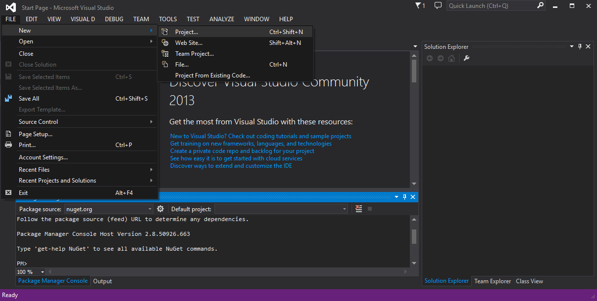
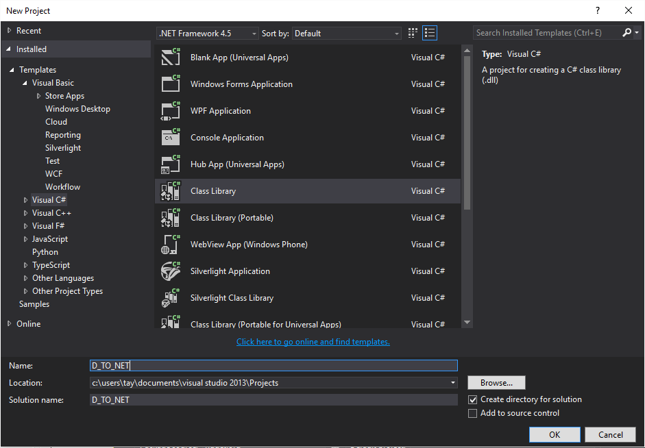
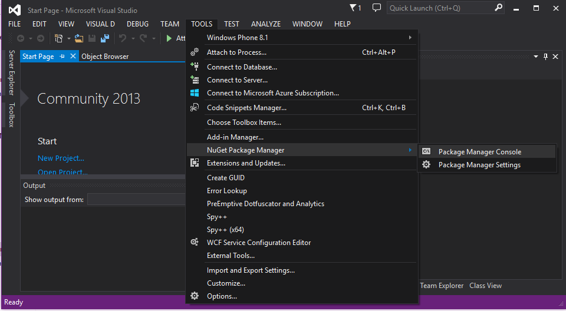
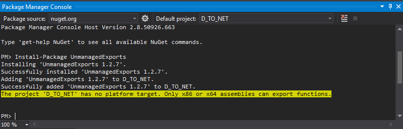
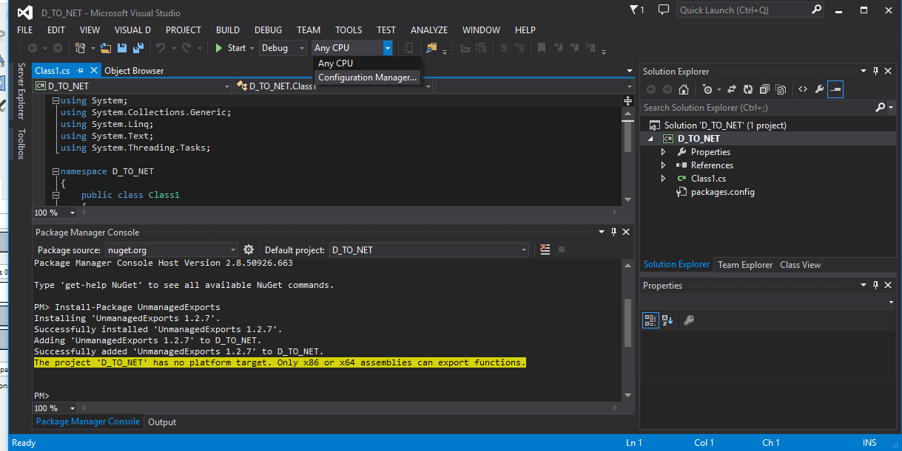
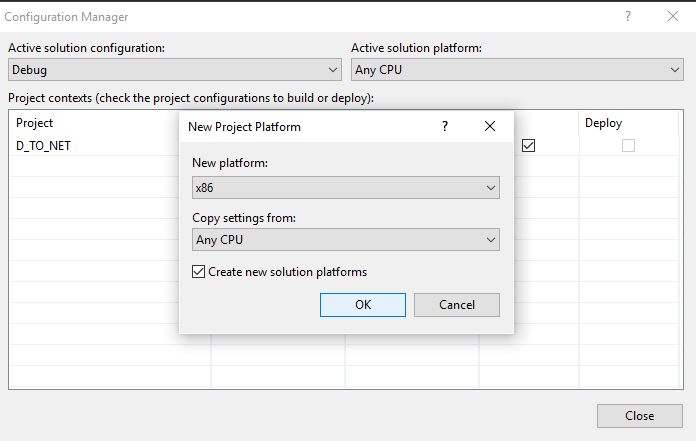

# Calling-NET-from-D
An example of how I set up a call to .NET on windows.

If you do the following you might be able to:
- Create a .NET DLL that can be called from D.
- Use function calls to move data between .NET and D

First think to make sure of is that you have the correct environment to get this set up. 

1. Install the latest VS Community Edition. I'm using 2013, but It also works with 2015.
2. Install or Re-install the DMD compiler. 

   __NOTE: This step is important because when dmd installs it checks the environment for VS and if it finds it compiles the runtime/phobos for 32/64 bit coff.__
   
3. Start a new Project-> Class Library

   

   

4. Open the Nuget Console 

   __NOTE: This step uses a nuget library [Unmanaged exports](https://www.nuget.org/packages/UnmanagedExports)__

   

5. Enter the following command into the PM prompt

   ```
   Install-Package UnmanagedExports
   ```

   


6. Set the target for the dll, I use x86 in the example. To do so Open the Configuration Manager

   
   
   
7. Add the static functions and includes
   ```C#
   using System;
   using System.Collections.Generic;
   using System.Linq;
   using System.Text;
   using System.Threading.Tasks;
   
   using RGiesecke.DllExport;             //For DllExport
   using System.Runtime.InteropServices;  //For CallingConvention
   
   namespace D_TO_NET
   {
       public class Class1
       {
           [DllExport("csHello", CallingConvention = CallingConvention.Cdecl)]
           static string Hello()
           {
               string message = "Hello, MessageBox!";
               // Show message box
               return message;
           }
       }
   }
   ```
8. Compile .NET then copy the .dll and the .lib file to the same directory as your d code.

   ```D
   /*caller.d*/
   import std.stdio;
   import std.string;

   pragma(lib, "UnmanagedInterface.lib"); //Use to import library

   extern(C) char * csHello(); //Name of the C interface function

   string Hello(){return cast(string) csHello().fromStringz();} //An optional Wrapper

   void main(){
   	writeln(Hello());
   }
   ```

9. To compile the d code at least for 32 bit use:
   ```bat
   dmd caller.d -m32mscoff
   ```
1. If everything worked you should get the a responce from .NET
   ```
   Hello, MessageBox!
   ```
